# 리액티브 프로그래밍
* [츨처-길은 가면, 뒤에 있다.](https://12bme.tistory.com/570?category=682904)

서버 다수와 통신하게 되면 API 호출 각각에 콜백을 추가하게 된다. 콜백이 늘어나면 애플리케이션의 복잡성도 증가(callback hell)하게 된다. RxJava는 자바로 리액티브 프로그래밍을 할 수 있는 라이브러리이며 비동기 프로그래밍과 함수형 프로그래밍 기법을 함께 활용한다. RxJava2는 Maybe나 Flowable 같은 새로운 클래스가 추가되었고 비동기 테스팅도 자연스럽게 할 수 있다.

리액티브 프로그래밍은 복잡한 비동기 프로그램을 쉽게 만들 수 있게 해준다. 리액티브의 의미에서 알 수 있듯이 이벤트(스크린 터치, 마우스 클릭, 키 입력, 서버의 비동기 응답)에 소비자가 비동기로 반응하여 처리한다. 또한 비동기에서 처리하기 힘든 에러 처리나 데이터 가공을 쉽게 할 수 있게 도와주기도 한다. 이벤트를 콜백이 아닌 데이터의 모음으로 모델링하기 때문이다.

RxJava 라이브러리는 리액티브 프로그래밍 개념의 자바 구현체이다. RxJava 라이브러리는 1.x 버전을 거쳐 2016년에 전면 개편된 RxJava 2.0을 출시했다. 
---

## 리액티브 프로그래밍
리액티브 프로그래밍은 데이터 흐름과 전달에 관한 프로그래밍 패러다임이다. 기존의 명령형(imperative) 프로그래밍은 주로 컴퓨터 하드웨어를 대상으로 프로그래머가 작성한 코드가 정해진 절차에 따라 순서대로 실행된다. 그러나 리액티브 프로그래밍은 데이터 흐름을 먼저 정의하고 데이터가 변경되었을때 연관되는 함수나 수식이 업데이트되는 방식이다.

리액티브 프로그래밍을 가장 쉽게 이해할 수 있는 예는 엑셀이다. 이 프로그램은 각 cell에 값을 넣거나 혹은 다른 cell을 조합해서 원하는 값을 계산한다. 예를 들어 올해 1월부터 12월까지의 매출액의 합을 구한다고 가정한다. 매월 매출액은 리액티브 프로그래밍의 데이터 소스(data source)에 해당한다. 특정 월 매출액의 변경이 생길때 리액티브 프로그래밍은 변경된 매출액을 다시 가져와서 총합을 구하는 방식이 아니라 매월 매출액으로 지정해놓은 데이터 소스에서 변경된 값을 전달한다. 전달된 변경 개별 값이 미리 지정해둔 수식을 통해 계산되어 연말 매출액을 갱신하게 된다.

명령형 프로그래밍 방식은 변경이 발생했다는 통지를 받아서 연말 매출액을 새로 계산하는 당겨오는(pull) 방식이지만, 리액티브 프로그래밍은 데이터 소스가 변경된 데이터를 밀어주는(push) 방식이다. 일종의 옵저버 패턴이다.

리액티브 프로그래밍은 새로운 프로그래밍 방식이 아니다. 이미 1990년대에 제시된 개념이다. 컴퓨터 프로그래밍에서는 모델의 값에 변화가 생겼을때 뷰를 자동으로 업데이트해주는 목적으로 사용했다. 앞서 연말 매출액 예에서는 매월 매출액이 모델이 된다. 또한 하드웨어 분야에서는 전자회로 일부 소자의 속성값이 변경되었을때 전체 회로에 미치는 영향을 바로 알 수 있는 HDL(Hardware Description Language)이 리액티브 프로그래밍이다. 어떤 기능이 직접 실행되는 것이 아니라 시스템에 어떤 이벤트가 발생했을때 처리하는 것이다.

네트워크 프로그래밍할때 사용하는 콜백(callback)이나 UI 프로그래밍할때 버튼 이벤트를 처리하는 클릭 리스너도 개념상으로는 리액티브 프로그래밍에 해당한다. 이 전통적인 개념에 몇가지 요소를 추가해야 RxJava 기반의 리액티브 프로그래밍이라고 할 수 있다.

### 1. 자바 언어와 리액티브 프로그래밍
자바 언어와 리액티브 프로그래밍은 대략 두가지 관계가 있다고 정리할 수 있다.

* 기존 pull 방식의 프로그래밍 개념을 push 방식의 프로그래밍 개념으로 바꾼다.
* 함수형 프로그래밍의 지원을 받는다.

자바 언어는 객체지향 프로그래밍 언어이다. 예를 들어 연간 매출액을 계산하는 프로그램을 자바로 작성한다면 데이터베이스에서 월간 매출액의 합계를 가져와서(pull 방식) 결과를 다시 계산하게 된다. 그리고 계산 시점은 아마 사용자가 <새로 고침> 버튼을 눌렀을 때가 될것이다. 즉, 별도의 이벤트를 받아서 다시 계산하는 방식으로 개발하지 않는다는 뜻이기도 하다.

앞서 언급한 예를 구현하는 수준이라면 리액티브 프로그래밍을 하지 않아도 된다. 하지만 전국에 있는 매장 각각의 매출액 정보를 실시간으로 집계한다고 가정해보자. 또는 본사에서 전달하려는 어떤 분석 데이터를 전국에 있는 수많은 매장에 통지해야 하는 생각해보자. 기존의 프로그램으로는 각 매장의 변화 상황을 데이터베이스에서 가져와야(pull 방식) 한다. 혹은 전국에 있는 매장에 분석 데이터를 통지하려면 전체 매장 리스트를 기반으로 순차적으로 변화상황을 전달해야 한다. 리액티브 프로그래밍에서는 데이터의 변화가 발생했을때 변경이 발생한 곳에서 새로운 데이터를 보내(push 방식)준다. 기존 자바 프로그래밍이 pull 방식이라면 리액티브 프로그래밍은 push 방식이다.

콜백이나 옵저버 패턴을 넘어서 RxJava 기반의 리액티브 프로그래밍이 되려면 함수형 프로그래밍이 필요하다. 콜백이나 옵서버 패턴은 옵서버가 1개이거나 단일 스레드 환경에서는 문제가 없지만 멀티 스레드 환경에서는 사용할때 많은 주의가 필요하다. 대표적인 예가 데드락과 동기화 문제이다.

함수형 프로그래밍은 부수 효과(side effect)가 없다. 콜백이나 옵저버 패턴이 스레드에 안전하지 않은 이유는 같은 자원에 여러 스레드가 경쟁 조건(race condition)에 빠지게 되었을때 예측할 수 없는 잘못된 결과가 나오기 때문이다. 이를 부수 효과라고 한다. 한두 개의 스레드가 있을때는 정상 동작하다가 수십 수백 개의 스레드가 동시에 단일 자원에 접근하면 계산 결과가 꼬이고 디버깅하기가 매우 어렵게 된다.

함수형 프로그램이은 부수 효과가 없는 순수 함수(pure function)를 지향한다. 따라서 멀티 스레드 환경에서도 안전하다. 자바 언어로 리액티브 프로그래밍을 하기 위해서는 함수형 프로그래밍의 지원이 필요하다.

RxJava를 비롯한 리액티브 프로그래밍을 공부하다보면 새롭게 등장하는 개념때문에 혼란에 빠질때가 있다. 프로그래밍 스타일도 다르고 프로그래머가 문제를 바라봐야하는 관점도 달라지기 때문이다. 리액티브 프로그래밍은 데이터 흐름과 변화의 전달에 관한 프로그래밍 패러다임이다.

컴퓨터 프로그램에는 크게 세 가지 종류가 있다. 첫번째는 변환 프로그램으로 주어진 입력값을 바탕으로 결과를 계산하는 프로그램이다. 일반적인 예는 컴파일러와 수치 계산 프로그램이다. 두번째는 상호작용 프로그램으로 프로그램이 주도하는 속도로 사용자 혹은 다른 프로그램과 상호작용을 한다. 사용자의 관점으로볼때 시분할(time-sharing) 시스템은 상호작용 프로그램이다(프로그램의 관점에서 시간을 활용하기 때문). 리액티브 프로그램은 주변의 환경과 끊임없이 상호작용을 하는데 프로그램이 주도하는 것이 아니라 환경이 변하면 이벤트를 받아 동작한다. 상호작용 프로그램은 자신의 속도에 맞춰 일하고 대부분 통신을 담당한다. 반면 리액티브 프로그램은 외부 요구에 반응에 맞춰 일하고 대부분 정확한 인터럽트 처리를 담당한다.

다소 원론적이지만 리액티브 프로그래밍을 이해하는데 필요한 개념이 담겨있다. 보통 애플리케이션을 만드는 프로그래머가 작성하는 프로그램은 변환프로그램이거나 상호작용 프로그램이다. 인터럽트 같은 개념은 시스템 프로그래머가 담당한다. 혹은 클라이언트 요청을 처리하는 서버 프로그래밍은 리액티브 프로그래밍에 가깝다. 애플리케이션에서 RxJava와 같은 리액티브 프로그래밍을 하려면 누군가 리액티브 프로그래밍을 할 수 있는 기반 시설을 제공해주어야 한다. 즉, 데이터 소스를 정의할 수 있고 그것의 변경사항을 받아서 프로그램에 알려줄(push) 존재가 필요하다. JVM 위의 자바 언어로 구현해놓은 라이브러리가 RxJava이다.

## 2. RxJava를 만들게 된 이유
RxJava는 넷플릭스(Netflix)의 기술 블로그에서 처음 소개되었다. 그 당시 넷플릭스는 REST 기반의 서비스 API 호출 횟수와 서비스의 전반적인 성능을 개선하는 프로젝트를 진행했고, 그결과 .NET 환경의 리액티브 확장 라이브러리(Rx)를 JVM에 포팅하여 RxJava를 만들었다. 넷플릭스에서 RxJava를 만들게된 핵심적인 이유를 다음과 같이 밝혔다.

* 동시성을 적극적으로 끌어안을 필요가 있다(Embrace Concurrency)
* 자바 Future를 조합하기 어렵다는 점을 해결해야 한다(Java Futures are Expensive to Compose)
* 콜백 방식의 문제점을 개선해야 한다(Callbacks Have Their Own Problems)

첫번째 이유의 원인은 자바가 동시성 처리를 하는데 번거로움이 있기 때문이다. 이를 해결하려고 넷플릭스는 클라이언트의 요청을 처리하는 서비스 계층(service layer)에서 동시성을 적극적으로 끌어안았다. 클라이언트의 요청을 처리할때 다수의 비동기 실행 흐름(스레드 등)을 생성하고 그것의 결과를 취합하여 최종 리턴하는 방식으로 내부 로직을 변경했다.

두번째 이유의 원인은 2013년 당시 자바8에서 제공하는 CompletableFuture 같은 클래스가 제공되지 않았기 때문이다. 그래서 비동기 흐름을 조합할 방법이 거의없었다. RxJava에서는 이를 해결하려고 비동기 흐름을 조합(compose)할 수 있는 방법을 제공한다. RxJava에서는 조합하는 실행 단위를 리액티브 연산자(Operators)라고 한다.

세번째 이유의 원인은 콜백이 콜백을 부르는 콜백 지옥(Callback Hell) 상황이 코드의 가독성을 떨어뜨리고 문제 발생시 디버깅을 어렵게 만들기 때문이다. 비동기 방식으로 동작하는 가장 대표적인 프로그래밍 패턴은 콜백이다. 그래서 RxJava는 콜백을 사용하지 않는 방향으로 설계해 이를 해결했다. 그래서 RxJava는 콜백을 사용하지 않는 방향으로 설계해 이를 해결했다.

리액티브 프로그래밍은 비동기 연산을 필터링, 변환, 조합해 위 세가지 핵심이유를 해결할 수 있다. 따라서 RxJava는 Observable과 같은 데이터 소스와 map(), filter(), reduce()와 같은 리액티브 연산자를 제공한다.

RxJava는 2016년 10월에 완전히 새로 작성한 RxJava 2.0을 발표했다. RxJava 2.0은 RxJava 1.x를 Reactive-Streams 스펙 기반으로 새롭게 개선한 것이므로 공통점도 많고 차이점도 많다.

Reactive-Stream 스펙은 자바8에 도입된 Stream API와 Observable 기반의 리액티브 프로그래밍을 포괄하는 표준 스펙으로 자바 9에 도입되었다.

## 3. RxJava 처음 시작하기

```xml
<dependency>
    <groupId>io.reactivex.rxjava2</groupId>
    <artifactId>rxjava</artifactId>
    <version>2.2.19</version>
</dependency>
```

```java
import io.reactivex.Observable;

public class FirstExample {
    public void emit() {
        Observable.just("Hello", "RxJava 2!!")
            .subscribe(System.out::println);
    }
    
    public static void main(String args[]) {
        FirstExample demo = new FirstExample();
        demo.emit();
    }
}
```

소스 코드에서 쉽게 추측할 수 있듯이 "Hello"와 "RxJava 2!!" 문자열을 받아서 System.out.println()을 실행한다. import 키워드 부분을 살펴보면 RxJava2의 기본 패키지 이름은 io.reactivex이다. ReacitveX의 홈페이지 주소(http://reactivex.io)를 거꾸로 쓴것과 같다.

### 1) Observable 클래스
Observable 클래스는 데이터의 변화가 발생하는 데이터 소스(data source)이다. 연간 매출액 예에서는 개별적인 월간 매출액 데이터에 해당한다. 

### 2) just() 함수
Observable 클래스의 just() 함수는 가장 단순한 Observable 선언 방식이다. 위 예에서는 데이터 소스에서 "Hello"와 "RxJava 2!!"를 발행했다. Integer와 같은 래퍼타입부터 Order 같은 사용자 정의 클래스의 객체도 인자로 넣을 수 있다.

### 3) subscribe() 함수
subscribe() 함수는 Observable을 구독한다. Observable은 subscribe() 함수를 호출해야 비로소 변환한 데이터를 구독자에게 발행한다(just() 함수만 호출하면 데이터를 발행하지 않는다). 이 부분은 옵저버 패턴과 동일하다고 생각하면 된다. 반드시 데이터를 수신할 구독자가 subscribe() 함수를 호출해야 Observable에서 데이터가 발행된다.

### 4) System.out::println
수신한 데이터를 System.out.println을 통해 호출했다. System.out::println 부분은 자바 8의 메서드 레퍼런스를 활용한 것이다. 만약 메서드 레퍼런스를 사용하지 않으면 data -> System.out.println(data)와 동일하다. Observable이 발행하는 데이터 data 인자로 들어온다.

### 5) emit() 메서드
동사 emit은 '어떤 것을 내보내다'라는 뜻인데 RxJava 개발 문서에서는 Observable이 subscribe() 함수를 호출한 구독자에게 데이터를 발행하는 것을 표현하는 용어로 사용한다. RxJava 관련 문서에 자주 등장하는 단어이다.

## 4. RxJava를 어떻게 공부할 것인가
자바는 전통적인 스레드 기반의 프로그래밍이다. 하지만 RxJava는 비동기 프로그래밍을 위한 라이브러리라서 개념과 접근 방식이 다르다. 따라서 배우는데 진입 장벽이 높은 편이다. 많은 온라인 문서에서 가파란 학습 곡선(steep learning curve)이 있다고 이야기할 정도다.

전통적인 스레드 기반의 프로그래밍은 다수의 스레드를 활용하는 경우 예상치 못한 문제가 발생하고 디버깅하기도 어려웠다. 특히 문제를 재현하기 어렵거나 미묘한 경우도 상당수 발생한다. 이러한 문제를 해결하기 위해 RxJava는 함수형 프로그래밍 기법을 도입했다. 함수형 프로그래밍은 부수 효과가 없는 순수 함수를 지향하므로 스레드에 안전하다.

자바는 함수형 언어가 아니므로 RxJava 라이브러리는 순수 함수로 작성된 리액티브 연산자를 제공한다. 이 리액티브 연산자 덕분에 RxJava는 리액티브 프로그래밍이 되는 것이다. 리액티브 연산자를 활용하면 목적을 달성할 수 있는 도구인 '함수형 프로그래밍' 방식으로 '스레드에 안전한 비동기 프로그램'을 작성할 수 있다.

RxJava를 활용하여 코딩하는데 어려움을 느끼는 이유는 함수형 연산자를 어떻게 호울해야 하는지 모르기 때문이다. 당장 map(), filter(), reduce(), flatMap()과 같은 함수 정의는 물론, 함수의 입력과 출력 방법이 무엇인지 알기 어려울 수 있다.

따라서 다음과 같은 학습 순서를 권장한다.

* 1. Observable 클래스를 명확하게 이해한다. 특히 Hot Observable과 Cold Observable의 개념을 꼭 이해해야 한다.
* 2. 간단한 예제로 map(), filter(), reduce(), flatMap() 함수의 사용법을 익힌다.
* 3. 생성 연산자, 결합 연산자, 변환 연산자 등 카테고리별 주요 함수를 공부한다.
* 4. 스케줄러의 의미를 배우고 subscribeOn()과 observeOn() 함수의 차이를 알아둔다.
* 5. 그밖의 디버깅, 흐름 제어 함수를 익힌다.

### RxJava 프로그래밍 챕터별 흐름.
* 가장 먼저 데이터 변경이 발생하는 Observable 클래스를 배운다. 배열과 같은 단순한 자료구조부터 마우스 이벤트, 버튼 클릭 이벤트, 센서 이벤트 등 데이터 소스라면 무엇이든 Observable 클래스의 인스턴스가 될 수 있다. 또한 Observable의 개념을 바탕으로 Subject, Single, Maybe 등의 클래스를 배운다. 모두 Observable의 특수한 경우이다.

* 함수형 프로그래밍의 기본 패턴인 map-filter-reduce에 대해서 배운다. 이것만으로 어떠한 부수 효과가 없는 데이터 처리를 경험해볼 수 있다. RxJava에서는 위에 대응되는 map(), filter(), reduce() 함수를 제공한다. 특히 flatMap()은 map() 등의 기본이 되는 함수로 처음에는 이해하기 어려울수 있을 수 있다.

* interval(), zip(), combineLatest(), switchMap() 함수 등 주요 카테고리별로 구분해 연산자를 배운다. 각 함수는 생성 연산자, 반환 연산자, 결합 연산자, 조건 연산자, 유틸리지 연산자 등으로 나뉘어 있으니 카테고리의 의미를 잘 안다면 개별 연산자의 동작을 이해하는 것이 어렵지는 않다. 또한 각 함수의 마블 다이어그램을 보면서 어떻게 동작하는지 살펴볼 것이므로 반드시 마블 다이어그램을 보고 동작 내용을 머릿속에 그려볼 것을 권장한다.

* RxJava 때문에 달라지는 비동기 프로그래밍에 대해 다룬다. 스케줄러에 대한 개념을 배우고 RxJava에서 제공하는 IO 스케줄러, 계산 스케줄러 및 트램펄린 스케줄러의 활용법에 대해서 배운다. 또한 비동기 프로그래밍을 하는데 왜 subscribeOn()과 observeOn() 함수가 필요한지도 알아본다. 스레드로 대표되는 전통적인 비동기 프로그래밍이나 콜백 방식과는 차별화된 다른 방식을 배우게 될 것이다.

* 디버깅과 예외 처리를 다룬다. RxJava로 코딩하면 부수 효과를 염려하여 로그를 찍을수 없다고 생각할 수 있지만 doOnNext() 함수 등은 프로젝트에서 꼭 필요하다. 또한 기존 자바의 try-catch 문을 사용하지 않는 예외 처리에 대해 배운다.

### RxJava 1.x와 RxJava 2.x 중 어느 것을 사용할 것인가?
RxJava 공식 위키에 따르면 1.x 버전은 2017년 6월부터 기능을 더이상 추가하지 않고(feature freeze) 2018년 3월에 개발을 중단했다. RxJava 1.x는 2013년에 나왔기 때문에 프로젝트에서 RxJava를 활용하는 개발자들에게는 1.x 버전이 편리하겠지만 자바9에 추가되는 Flow API까지 염두에 둔다면 RxJava2를 공부하는 것이 좋다. 

### 자바 8을 알아야만 리액티브 프로그래밍을 할 수 있을까?
RxJava를 배우는 데는 자바 8을 사용하지 않아도 된다. RxJava는 자바8에서 제공하는 Consumer, Predicate, Function과 같은 함수형 인터페이스를 자체 구현하였고 자바 6 이상이면 동작한다.
자바 8의 람다 표현식과 함수 레퍼런스를 활용하는 코드는 가독성을 좋게한다.

## 5. 마블 다이어그램 보는 법
마블 다이어그램은 RxJava를 이해하는 핵심 도구이다. map(), flatMap() 함수 등의 수많은 리액티브 연산자들을 이해하는데 큰 도움을 준다. 마블 다이어그램은 예를 보면서 어떻게 활용하는지 배우는 것이 가장 좋다.

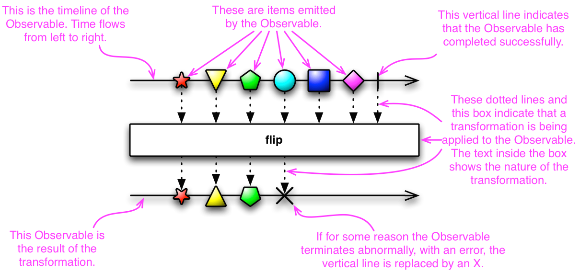

* 1. 위에 있는 실선은 Observable의 시간 표시줄(timeline)이다. 시간순으로 데이터가 발행되는 것을 표현한다.
* 2. Observable에서 발행하는 데이터이다. 시간 순서대로 별, 삼각형, 오각형, 원 등의 도형을 발행한다. 데이터를 발행할때는 onNext 알림이 발생한다.
* 3. 파이프(|)는 Observable에서 데이터 발행을 완료했다는 의미이다. 한번 완료하면 이후에는 더이상 데이터를 발행할 수 없다. 완료하면 onComplete 알림이 발생한다.
* 4. 아래로 내려오는 점선 화살표는 각각 함수의 입력과 출력데이터이다. 가운데 박스는 함수를 의미한다. flip() 함수는 입력값을 뒤집는 함수이다. 따라서 입력값의 색상은 그대로 두고 모양을 위아래 180도 회전하여 뒤집는다.
* 5. 함수의 결과가 출련된 표시시간줄이다.
* 6. 엑스(X)는 함수가 입력값을 처리할때 발생한 에러를 의미한다. 에러 발생 시에는 onError 알림이 발생한다.

그럼 조금 더 복잡한 마블 다이어그램을 살펴본다. RxJava의 combineLatest() 함수의 마블 다이어그램으로 2개 이상의 Observable을 처리할 수 있다. 이전 flip 함수 마블 다이어그램과 다른 점은 Observable의 시간 표시줄이 1개가 아니라 2개로 늘었다는 점이다.

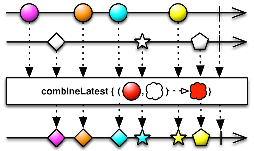

* 1. 첫번째 Observable은 같은 모양(원)이지만 색깔이 다른 도형을 발행한다.
* 2. 두번째 Observable은 모양은 다르지만 번호가 없는 도형을 발행한다.
* 3. combineLatest() 함수는 첫번째 Observable의 도형과 두번째 Observable의 도형이 모두 들어오면 둘을 합성한다.
* 4. 가장 아래 시간 표시줄은 combineLatest() 함수의 실행 결과로 자세히 살펴보면 두 Observable의 결과를 조합한 것임을 알 수 있다. 첫번째 Observable에서는 색상을 취하고 두번째 Observable에서는 도형의 모향을 취하고 있다.

RxJava는 리액티브 프로그래밍이라는 새로운 시각을 제공해주고 비동기 프로그래밍과 함수형 프로그래밍을 모두 활용해 문제를 해결할 수 있다. RxJava는 마블 다이어그램을 배운다고해도 과언이 아니다.

# RxJava 요소 - Observable
Observable은 데이터 흐름에 맞게 알림을 보내 구독자가 데이터를 처리할 수 있도록 한다. RxJava 프로그래밍은 Observable에서 시작해 Observable로 끝난다고 해도 과언이 아닐 정도로 중요한 개념이다. Observable 클래스와 그의 파생 클래스에 대해 알아보도록 한다.

RxJava 1.x에서는 데이터 소스를 Observable과 Single 클래스로 구성했다. RxJava 2.x에서도 여전히 두 클래스가 존재하지만 Observable 클래스는 상황에 맞게 세분화해 각각 Observable, Maybe, Flowable 클래스로 구분해 사용한다.

Maybe 클래스는 reduce() 함수나 firstElement() 함수와 같이 데이터가 발행될 수 있거나 혹은 발행되지 않고도 완료되는 경우를 의미한다. 또한 Flowable 클래스는 Observable에서 데이터가 발행되는 속도가 구독자가 처리하는 속도보다 현저하게 빠른 경우 발생하는 배압(Back Pressure) 이슈에 대응하는 기능을 추가로 제공한다.

## 1. Observable 클래스
Observable은 옵저버(Observer) 패턴을 구현한다. 옵저버 패턴은 객체의 상태 변화를 관찰하는 관찰자(옵저버) 목록을 객체에 등록한다. 그리고 상태 변화가 있을때마다 메서드를 호출하여 객체가 직접 목록의 각 옵저버에게 변화를 알려준다. 라이프 사이클은 존재하지 않으며 보통 단일 함수를 통해 변화만 알린다.

#### Observable의 뜻은 무엇일까?
자바로 프로그래밍하다 보면 어떤 클래스의 이름에 '-able'이라는 접미사가 붙은것을 보게 된다. 예를 들어 스레드를 새로 생성하는 Runnable 인터페이스, 반복자(iterator)를 활용해 데이터를 차례로 가져오는 Iterable 인터페이스 등이 있다.

리액티브 프로그래밍에서의 Observable은 어떻게 설명하면 좋을까? 직관적으로 설명하자면 관찰자(Observer)가 관찰하는 대상이라고 말할 수 있다. "Observed라는 단어가 관찰을 통해서 얻은 결과를 의미한다면 Observable은 현재는 관찰되지 않았지만 이론을 통해서 앞으로 관찰할 가능성을 의미한다" 이 설명이 Observable의 의미를 잘 나타내고 있다고 표현되어 있다. 사용자가 버튼을 누르면 버튼에 미리 등록해 둔 onClick() 메서드를 호출해 원하는 처리를 하는 것이 옵저버 패턴의 대표적인 예이다.

RxJava의 Observable은 세가지의 알림을 구독자에게 전달한다.
* onNext: Observable이 데이터의 발행을 알린다. 기존의 옵저버 패턴과 같다.
* onComplete: 모든 데이터의 발행을 완료했음을 알린다. onComplete 이벤트는 단 한번만 발생하며, 발생한 후에는 더이상 onNext 이벤트가 발생해선 안된다.
* onError: Observable에서 어떤 이유로 에러가 발생했음을 알린다. onError 이벤트가 발생하면 이후에 onNext 및 onComplete 이벤트가 발생하지 않는다. 즉, Observable의 실행을 종료한다.

Observable 클래스에는 Observable을 생성하는 팩토리 함수, 중간 결과를 처리하는 함수, 디버그 및 예외 처리 함수가 모두 포함되어 있다. 따라서 많은 수의 함수가 존재한다. Observable을 생성할때는 직접 인스턴스를 만들지 않고 정적 팩토리 함수를 호출한다. 다양한 함수가 있으며 다음 표처럼 구분할 수 있다.

|---|---|
|팩토리 함수|함수|
|---|---|
|RxJava 1.x 기본 팩토리 함수|create(), just(), from()|
|RxJava 2.x 추가 팩토리 함수|fromArray(), fromIterable(), fromCallable(), fromFuture(), fromPublisher()|
|기타 팩토리 함수|interval(), range(), timer(), defer() 등|
 
### 1) just() 함수
데이터를 발행하는 가장 쉬운 방법은 기존의 자료구조를 사용하는 것이다. just() 함수는 인자로 넣은 데이터를 차례로 발행하려고 Observable을 생성한다(실제 데이터의 발행은 subscribe() 함수를 호출해야 시작한다). 한 개의 값을 넣을 수도 있고 인자로 여러 개의 값(최대 10개)을 넣을 수도 있다. 단 타입은 모두 같아야 한다.

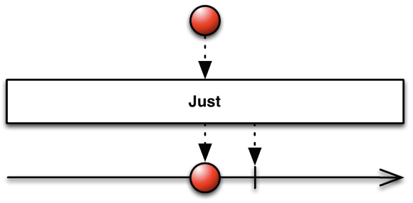

중앙의 원은 Observable에서 발행하는 데이터로 just() 함수를 거치면 입력한 원을 그대로 발행한다. 파이프(|) 표시는 모든 데이터 발행이 완료(onComplete 이벤트)되었음을 의미한다. 이번엔 인자가 2개 이상 N개인 just() 함수의 마블 다이어그램을 살펴본다.

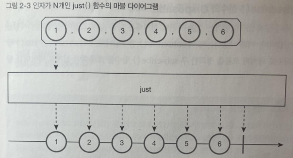

just() 함수로 1~6의 원을 1개씩 발행한다(이때 데이터 내용을 변경하지 않고 그대로 발행한다). 모두 발행한 이후에는 완료(|)한다. 위의 마블다이어그램의 코드는 다음과 같다.

```java
public class FirstExample {
    public void emit() {
        Observable.just(1, 2, 3, 4, 5, 6)
        .subscribe(System.out::println);
    }
    ...
}
```

### 2) subscribe() 함수와 Displosable 객체
RxJava는 내가 동작시키기 원하는 것을 사전에 정의해둔 다음 실제 그것이 실행되는 시점을 조절할 수 있다. 이때 사용하는 것이 subscribe() 함수이다. Observable은 just() 등의 팩토리 함수로 데이터 흐름을 정의한 후 subscribe() 함수를 호출해야 실제로 데이터를 발행한다.

RxJava는 선언형 프로그래밍을 지향한다. 선언형 프로그래밍은 명령형 프로그래밍(Imperative programming)의 반대말로 어떤 방법(how)으로 동작하는지가 아니라 프로그래밍할 대상이 무엇(what)인지 알려주는 것을 의미한다. 예를 들어 명령형 프로그래밍 언어에서는 실행할 알고리즘과 동작을 구체적으로 명시한다. 하지만 선언형 프로그래밍은 목표를 명시할 뿐 실행할 알고리즘을 명시하지는 않는다.

subscribe() 함수의 주요 원형은 아래와 같다.

```java
Disposable subscribe()
Disposable subscribe(Consumer<? super T> onNext)
Disposable subscribe(Consumer<? super T> onNext, Consumer<? super java.lang.Throwable> onError)
Disposable subscribe(Consumer<? super T> onNext, Consumer<? super java.lang.Throwable> onError, Action onComplete)
```

원형 각각은 다음 같은 의미가 있다.
* 인자가 없는 usbscirbe() 함수는 onNext와 onComplete 이벤트를 무시하고 onError 이벤트가 발생했을때만 OnErrorNotImplementedException을 던진다(throw). 따라서 Observable로 작성한 코드를 테스트하거나 디버깅할 때 활용한다.
* 인자가 1개 있는 오버로딩은 onNext 이벤트를 처리한다. 정상처리가 되면 onNext 이벤트만 실행이되며, onError 이벤트가 발생하면 OnErrorNotImplementedException을 던진다.
* 인자가 2개인 함수는 onNext와 onError 이벤트를 처리한다.
* 인자가 3개인 함수는 onNext, onError, onComplete 이벤트를 모두 처리할 수 있다.

앞 함수 원형은 모두 Disposable 인터페이스의 객체를 리턴한다. Disposable은 RxJava1.x의 Subscription(구독) 객체에 해당한다. 아래 2개 함수만 있다.

```java
void dispose()
boolean isDisposed()
```

#### Disposable 인터페이스 함수
dispose()는 Observable에게 더이상 데이터를 발행하지 않도록 구독을 해지하는 함수이다. Observable Contract에 따르면 Observable이 onComplete 알림을 보냈을때 자동으로 dispose()를 호출해 Observable과 구독자의 관계를 끊는다.

  Observable 계약 - http://reactivex.io/documentation/ko/contract.html

따라서 onComplete 이벤트가 정상적으로 발생했다면 구독자가 별도로 dispose()를 호출할 필요가 없다. isDisposed() 함수는 이름에서 알 수 있는 것처럼 Observable이 데이터를 발행하지 않는지(구독을 해지했는지) 확인하는 함수이다. 다음은 Observable의 알림과 Disposable에 관한 예제이다.

```java
Observable<String> source = Observable.juse("RED", "GREEN", "YELLOW");

Disposable d = source.subscribe(
    v -> System.out.println("onNext() : value : " + v),
    err -> System.err.println("onError() : err : " + err.getMessage()),
    () -> System.out.println("onComplete()")
);

System.out.println("isDisposed() : " + d.isDisposed());
```

먼저 Observable에는 단순히 'RED', 'GREEN', 'YELLOW'라는 문자열이 있다. 그다음 subscribe() 함수를 호출해 Observable이 데이터를 발행하도록 한다. subscribe() 함수에는 onNext, onError, onComplete 이벤트가 발생할때의 로그를 출력하도록 했다.

### 3) create() 함수
just() 함수는 데이터를 인자로 넣으면 자동으로 알림 이벤트가 발생하지만 create() 함수는 onNext, onComplete, onError 같은 알림을 개발자가 직접 호출해야 한다. 그래서 create()는 라이브러리가 무언가를 해준다기보다 개발자가 무언가를 직접 하는 느낌이 강한 함수이다.

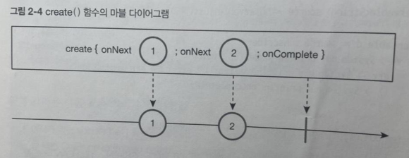

구독자에게 데이터를 발행하려면 onNext() 함수를 호출해야 하며 모든 데이터를 발행한 후에는 반드시 onComplete() 함수를 호출해야 한다. create() 함수의 원형은 아래와 같다.

Observable<T> create(ObservableOnSubscribe<T> source)
 
그리고 ObservabelOnSubscribe 인터페이스는 함수 1개만 포함하고 있다.

```java
public interface ObservableOnSubscribe<T> {
    void subscribe(ObservableEmitter<T> e) throws Exception;
}
```

create() 함수를 활용해 데이터를 발행하는 방법이다.

```java
Observable<Integer> source = Observable.create(
    (ObservableEmitter<Integer> emitter) -> {
        emitter.onNext(100);
        emitter.onNext(200);
        emitter.onNext(300);
        emitter.onComplete();
    }
);
source.subscribe(System.out::println);
```

Observable 클래스 타입인 source 변수에서는 onNext() 함수를 호출해 차례로 100, 200, 300이라는 데이터를 발행했다. 그리고 onComplete() 함수를 호출해 데이터 발행을 완료했다.

FirstExample 예제와는 다르게 Observable<Integer> 타입의 source 변수를 분리했는데 source 변수는 Cole Observable이다. 즉, 첫번째 문장만으로는 실제로 데이터를 발행하지 않고 두번째 문장에서 subscribe() 함수를 호출했을때 100, 200, 300의 값을 발행한다. subscribe() 함수를 호출하지 않으면 아무것도 출력되지 않는다는 뜻이다.

#### 람다 표현식 활용
참고로 create() 함수의 인자는 원래 ObservableOnSubscribe 인터페이스 타입이어야 한다. 위에서는 ObservableEmitter 인터페이스 객체를 인자로 받는 람다 표현식으로 처리했다. 람다 표현식을 활용하면 Observable.create()를 호출할때 불필요한 익명 객체나 멤버 변수를 기재하지 않고 꼭 필요한 변수만 소스 코드에 작성하면 되므로 소스코드의 가독성이 높아진다.

다음은 Observable.create()만 호출하고 subscribe() 함수를 호출하지 않은 예제이다.

```java
Observable<Integer> source = Observable.create(
    (ObservableEmitter<Integer> emitter) -> {
        emitter.onNext(100);
        emitter.onNext(200);
        emitter.onNext(300);
        emitter.onComplete();
    }
);
```

실행해보면 아무것도 출력되지 않는다. 그 이유는 subscribe() 함수를 호출하지 않았기 때문이다 .이번엔 subscribe() 함수를 변경한다. subscribe()의 인자로 System.out::println이라는 메서드 레퍼런스를 넣는다. 이를 람다 표현식으로 변경한다.

```java
Observable<Integer> source = Observable.create(
    (ObservableEmitter<Integer> emitter) -> {
        emitter.onNext(100);
        emitter.onNext(200);
        emitter.onNext(3000);
        emitter.onComplete();
    }
);
source.subscribe(data -> System.out.println("Result : " + data));
```

System.out::println 같은 형태를 자바 8에서는 메서드 레퍼런스라고 한다. 리액티브 프로그래밍에서는 앞서 설명한 람다 표현식과 메서드 레퍼런스를 적극적으로 사용하는 것이 좋다. 또한 람다 표현식과 메서드 레퍼런스를 사용할때는 다음 우선순위를 고려해서 사용 여부를 판단하기를 권한다.
* 1. 메서드 레퍼런스로 축약할 수 있는지 확인
* 2. 그다음 람다 표현식을 활용할 수 있는지 확인
* 3. 1~2를 활용할 수 없으면 익명 객체나 멤버 변수로 표현

람다 표현식의 장점을 살펴보겠다. data -> System.out.println("Result : " + data)라는 람다 표현식을 익명 객체로 변경하면 아래와 같다.

```java
Observable<Integer> source = 
    Observable.create((ObservableEmitter<Integer> emitter) -> {
        emitter.onNext(100);
        emitter.onNext(200);
        emitter.onNext(300);
        emitter.onComplete();
    }
);

source.subscribe(new Consumer<Integer>() {
    @Override
    public void accept(Integer data) throws Exception {
        System.out.println("Result : " + data);
    }
});
```

위 코드의 경우 subscribe()의 원형을 알아야 하고 Consumer<T> 클래스의 메서드도 매번 입력을 해주어야 하므로 번거롭다. 하지만 람다표현식은 익명 객체의 메서드 원형을 @Override로 기술하지 않아도 되므로 가독성이 높다. 프로그래머가 매번 메서드의 원형을 기억할 필요없이 자바 컴파일러가 추론하도록 해준다.

#### Observable.create()를 사용할때는 주의해야 한다.
RxJava 문서에 따르면 create()는 RxJava에 익숙한 사용자만 활용하도록 권고한다. create()를 사용하지 않고 다른 팩토리 함수를 활용하면 같은 효과를 낼 수 있기 때문이다. 만약 그래도 사용해야 한다면 아래 사항을 확인해야 한다.
* 1. Observable이 구독 해지(dispose)되었을때 등록된 콜백을 모두 해제해야 한다. 그렇지 않으면 잠재적으로 메모리 누수(memory leak)가 발생한다.
* 2. 구독자가 구독하는 동안에만 onNext와 onComplete 이벤트를 호출해야 한다.
* 3. 에러가 발생했을때는 오직 onError 이벤트로만 에러를 전달해야 한다.
* 4. 배압(back pressure)을 직접 처리해야 한다.

### 4) fromArray() 함수
just()나 create()는 단일 데이터를 다룬다. 단일 데이터가 아닐때는 fromXXX() 계열 함수를 사용한다. 원래 RxJava 1.x에서는 from()과 fromCallable() 함수만 사용했었다. 그런데 from() 함수를 배열, 반복자, 비동기 계산 등에 모두 사용하다 보니 모호함이 있었다. 따라서 RxJava2에서는 from() 함수를 세분화했고 그중 하나가 지금 소개하는 fromArray() 함수이다.

배열에 들어있는 데이터를 처리할때는 fromArray() 함수를 활용한다.

```java
Integer[] arr = {100, 200, 300};
Observable<Integer> source = Observable.fromArray(arr);
source.subscribe(System.out::println);
```

Integer[] 배열에 원하는 값을 담고 Observable.fromArray()를 호출했다. 그다음 subscribe() 함수를 호출하면 데이터를 차례로 발행하게 된다. 숫자뿐만 아니라 사용자 정의 클래스 객체도 넣을 수 있다.

RxJava에서 int 배열을 인식시켜려면 Integer[]로 변환해야 한다. 여러가지 방법이 있지만 자바 8의 Stream API에서는 다음과 같은 방법을 제공한다.

```java
private static Integer[] toIntegerArray(int[] intArray) {
    return IntStream.of(intArray).boxed().toArray(Integer[]::new);
}
```

#### Map 객체에 관한 Observable 클래스의 from() 함수는 없을까?
RxJava에는 List나 Set 객체의 from() 함수는 존재하는데 Map 객체에 관한 from() 함수는 왜 없을까? Map 인터페이스는 배열도 아니고 Interable<E> 인터페이스를 구현하지 않았으므로 from() 계열 함수는 존재하지 않는다. Map 인터페이스는 키-값 쌍으로 구성되었으므로 keySet() 함수의 순서를 정하면 만들 수 있을 수 있을 것이다.

### 5) fromCallable() 함수
RxJava는 비동기 프로그래밍을 하기 위한 라이브러리이다. 이전까지 기본적인 자료구조로 Observable을 생성하는 부분을 살펴봤다면 이번에는 기존 자바에서 제공하는 비동기 클래스나 인터페이스와의 연동을 살펴볼 차례이다. 먼저 살펴보는 것은 자바 5에서 추가된 동시성 API인 Callable 인터페이스이다. 비동기 실행 후 결과를 반환하는 call() 메서드를 정의한다.

```java
public interface Callable<V> {
    /**
     * 결과를 계산하고, 만약 그렇게 할 수없는 경우 예외를 던진다.
     * 
     * @return 계산된 결괏값
     * @throws Exception 계산을 완료할 수 없을때
     */
    V call() throws Exception;
}
```

run() 메서드가 있는 Runnable 인터페이스처럼 메서드가 하나고, 인자가 없다는 점에서 비슷하지만 실행결과를 리턴한다는 점에서 차이가 있다. 또한 Executor 인터페이스의 인자로 활용되기 때문에 잠재적으로 다른 스레드에서 실행되는 것을 의미하기도 한다.

다음 코드는 Callable 객체와 fromCallable() 함수를 이용해 Observable을 만드는 방법이다.

```java
Callable<String> callable = () -> {
    Thread.sleep(1000);
    return "Hello Callable";
};

Observable<String> source = Observable.fromCallable(callable);
source.subscribe(System.out::println);
```

callable 변수는 람다 표현식을 활용했다. call() 함수는 인자가 없으므로 () -> {} 로 나타내서 코드 가독성을 높였다. 

### 6) fromFuture() 함수
Future 인터페이스 역시 자바5에서 추가된 동시성 API로 비동기 계산의 결과를 구할때 사용한다. 보통 Executor 인터페이스를 구현한 클래스에 Callable 객체를 인자로 넣어 Future 객체를 반환한다. get() 메서드를 호출하면 Callable 객체에서 구현한 계산 결과가 나올때까지 블로킹(반환된 Future 객체에 get() 메서드를 호출하고 결괏값이 나올때까지 기다리는것을 의미)된다.

다음은 Future 객체에서 fromFuture() 함수를 사용해 Observable를 생성하는 방법이다.

```java
Future<String> future = Executors.newSingleThreadExecutor().submit(() -> {
    Thread.sleep(1000);
    return "Hello Future";
});

Observable<String> source = Observable.fromFuture(future);
source.subscribe(System.out::println);
```

Executors 클래스는 단일 스레드 실행자(SingleThreadExecutor) 뿐만 아니라 다양한 스레드풀(FixedThreadPool, CachedThreadPool)을 지원한다. 하지만 RxJava는 위와 같은 실행자를 활용하기 보다 RxJava에서 제공하는 스케줄러를 활용하도록 권장한다.

## Single 클래스
Single 클래스는 RxJava 1.x 부터 존재하는 Observable의 특수한 형태이다. Observable 클래스는 데이터를 무한하게 발행할 수 있지만 Single 클래스는 오직 1개의 데이터만 발행하도록 한다. 보통 결과가 유일한 서버 API를 호출할때 유용하게 사용할 수 있다. 

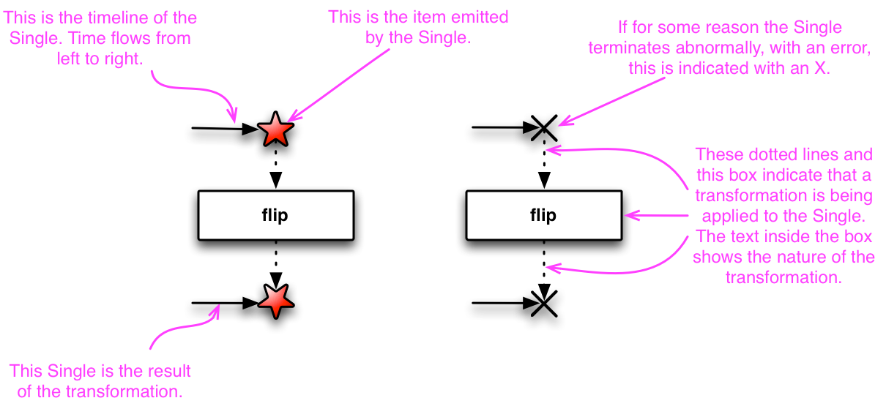

* Single 클래스의 시간 표시줄은 왼쪽에서 오른쪽으로 흐른다.
* Single 클래스에서 발행한 결과데이터이다.
* 이 Single 클래스는 flip() 함수의 결괏값이다.
* 오류가 발생하거나 Single이 비정상적으로 중단되는 경우는 X로 표기한다.

중요한 것은 데이터 하나가 발행과 동시에 종료(onSuccess)된다는 점이다. 라이프사이클 관점에서 보면 onNext()와 onComplete() 함수가 onSuccess() 함수로 통합된 것이다. 따라서 Single 클래스의 라이프 사이클 함수는 onSuccess(T value) 함수와 onError() 함수로 구성된다.

### 1) just() 함수

Single 클래스는 Observable과 거의 같은 방법으로 활용할 수 있다. 다음은 just() 함수를 활용해 Single 객체를 생성한다.

```java
Single<String> source = Single.just("Hello Single");
source.subscribe(System.out::println);
```

가장 간단한 방법은 Observable처럼 정적 팩토리 함수 just()를 호출하는 것이다. 그리고 subscribe() 함수를 호출하면 Single 클래스에서 데이터를 발행해 출력한다.

### 2) Observable에서 Single 클래스 사용

Single은 Observable의 특수한 형태이므로 Observable에서 변환할 수 있다. 다음은 Observable에서 Single 클래스를 사용하는 다양한 방법이다.

```java
// 1. 기존 Observable에서 Single 객체로 변환하기.
Observable<String> source = Observable.just("Hello Single");
Single.fromObservable(source)
    .subscribe(System.out::println);

// 2. single() 함수를 호출해 Single 객체 생성하기.
Observable.just("Hello Single")
    .single("default item")
    .subscribe(System.out::println);

// 3. first() 함수를 호출해 Single 객체 생성하기.
String[] colors = {"Red","Blue","Glod"};
Observable.fromArray(colors)
    .first("default value")
    .subscribe(System.out::println);

// 4. empty Observable에서 Single 객체 생성하기.
Observable.empty()
    .single("default value")
    .subscribe(System.out::println);

// 5. take() 함수에서 Single 객체 생성하기.
Observable.just(new Order("ORD-1"), new Order("ORD-2"))
    .take(1)
    .single(new Order("default order"))
    .subscribe(System.out::println);
```

첫번째 예는 Single.fromObservable을 활용하는 방법이다. 기존 Observable에서 첫번째 값을 발행하면 onSuccess 이벤트를 호출한 후 종료한다.

두번째 예는 Observable.just()를 통해서 생성된 Observable에 single() 함수를 호출한다. single() 함수는 default value를 인자로 갖는다. Observable에서 값이 발행되지 않을때도 인자로 넣은 기본값을 대신 발행한다.

세번째 예는 여러 개의 데이터를 발행할 수 있는 Observable을 Single 객체로 변환하는 것이다. first() 함수를 호출하면 Observable이 Single 객체로 변환된다. 또한 하나 이상의 데이터를 발행하더라도 첫번째 데이터 발행 후 onSuccess 이벤트가 발생한다.

네번째 예는 empty() 함수를 통해서 Single 객체를 생성하는 방법이다. 새번째 예처럼 첫번째 데이터 발행 후 onSuccess 이벤트가 발생한다는 점은 같다. 또한 두번째ㅐ 예처럼 Observable에서 값이 발행되지 않을때도 기본값을 갖는 Single 객체로 변환할 수 있다.

마지막은 take() 함수를 사용하는 예이다. 현재는 이런 방식으로도 Single 객체를 생성할수 있다는 정도만 알면 된다. String 같은 기본 타입뿐만 아니라 Order와 같은 사용자 정의 클래스도 Single에서 사용할 수 있다. subscribe() 함수에는 System.out::println이라는 메서드 레퍼런스를 인자로 사용했는데 Single 클래스에 넘겨진 Order 객체의 toString() 메서드가 호출된다.

#### 함수인가? 메서드인가?
리액티브 프로그래밍은 함수형 프로그래밍 기법을 활용하므로 용어를 혼용해서 사용할 수 있다. 예를 들어 데이터를 변환하는 map(), filter(), zip() 등의 연산자는 함수라고 부르는 것이 자연스럽다. '함수형 프로그래밍'에 가까운 리액티브 연산자(operator)는 함수라고 표기한다. 일반 자바 언어 기반은 메서드로 표기하기도 한다.

## Maybe 클래스
Maybe 클래스는 RxJava 2에 처음 도입된 Observable의 또다른 특수 형태이다. 영어의 'maybe'는 '아마도'라는 뜻이다. 이 뜻처럼 Single 클래스와 마찬가지로 최대 데이터 하나를 가질수 있지만 데이터 발행 없이 바로 데이터 발생을 완료(Single 클래스는 1개 완료, Maybe 클래스는 0 혹은 1개 완료)할 수도 있다. 즉, Maybe 클래스는 Single 클래스에 onComplete 이벤트가 추가된 형태이다.

Maybe의 마블 다이어그램은 다음과 같다.

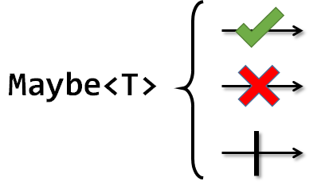

상단부터 onSuccess 이벤트, onError 이벤트, onComplete 이벤트에 해당한다.

Maybe 객체는 Maybe 클래스를 이용해 생성할 수 있지만 보통 Observable의 특정 연산자를 통해 생성할때가 많다. 또한 Maybe 객체를 생성할 수 있는 리액티브 연산자에는 elementAt(), firstElement(), flatMapMaybe(), lastElement(), reduce(), singleElement() 함수 등이 있다.

## Hot Observable
Observable에는 Hot Observable과 Cold Observable이 있다. Cold Observable은 마치 냉장고에 들어있는 냉동식품과 같다. Observable을 선언하고 just(), fromIterable() 함수를 호출해도 옵저버가 subscribe() 함수를 호출하여 구독하지 않으면 데이터를 발행하지 않는다. 다른말로 lazy 한 접근법이다.

Hot Observable은 구독자가 존재여부와 관계없이 데이터를 발행하는 Observable이다. 따라서 여러 구독자를 고려할 수 있다. 단, 구독자로서는 Observable에서 발행하는 데이터를 처음부터 모두 수신할 것을 보장할 수 없다. 즉, Cold Observable은 (구독자가) 구독하면 준비된 데이터를 처음부터 발행한다. 하지만 뜨거운 Observable은 구독한 시점부터 Observable에서 발행한 값을 받는다.

Cold Observable의 예는 웹 요청, 데이터베이스 쿼리와 파일 읽기 등이다. 보통 내가 원하는 URL이나 데이터를 지정하면 그때부터 서버나 데이터베이스 서버에 요청을 보내고 결과를 받아온다.

지금까지 다룬 Observable은 모두 Cold Observable이었다. 변도의 언급이 없으면 Cold Observable이라고 생각하면 된다. 한편 Hot Observable의 예는 마우스 이벤트, 키보드 이벤트, 시스템 이벤트, 센서 데이터와 주식 가격 등이 있다. 온도, 습도 센서의 데이터를 처리하는 앱이라면 최근의 온도, 습도 정보만 사용자에게 표시하면 된다.

#### 구독자가 여러 명이라는 것은 무슨 의미일까?
RxJava는 "구독자가 여러명이다"라는 뜻을 제대로 파악하는 것이 어렵다. 예를 들어 서버에 요청한 결과로 반환된 JSON 문서를 파싱해 원하는 속성을 추출한다고 해본다. 날씨 정보, 지역 정보, 시간 정보를 반환하는 경우 RxJava에서는 위의 세가지 정보를 구독자라고 생각하면 편리하다. 데이터의 원천은 한 곳이지만 최종적으로 원하는 결과 데이터가 여러 종류일 때는 각각을 구독자로 생각하면 좋다.

Hot Observable에는 주의할 점이 있다. 배압(back pressure)를 고려해야 한다는 점이다. 배압은 Observable에서 데이터를 발행하는 속도와 구독자가 처리하는 속도의 차이가 클때 발생한다. 기존 RxJava 1.x에서는 Observable 클래스에 별도의 배압 연산자들을 제공했지만 RxJava2에서는 Flowable이라는 특화 클래스에 배압을 처리한다.

Cold Observable을 뜨거운 Observable 객체로 변환하는 방법은 Subject 객체를 만들거나 ConnectableObservable 클래스를 활용하는 것이다.

## Subject 클래스
Subject 클래스는 Cold Observable을 Hot Observable로 바꿔준다. Subject 클래스의 특성은 Observable의 속성과 구독자의 속성이 모두 있다는 점이다. Observable처럼 데이터를 발행할 수도 있고 구독자처럼 발행된 데이터를 바로 처리할 수도 있다.

RxJava에서 제공하는 주요 Subject 클래스에는 AsyncSubject, BehaviorSubject, PublishSubject, ReplaySubject 등이 있다. 각 클래스는 어떤 특징이 있는지 알아본다.

### 1) AsyncSubject 클래스
AsyncSubject 클래스는 Observable에서 발행한 마지막 데이터를 얻어올 수 있는 Subject 클래스이다. 완료되기 전 마지막 데이터에만 관심이 있으며 이전 데이터는 무시한다.

다음 마블 다이어그램을 보면 어떻게 동작하는지 명확하게 알수 있다.

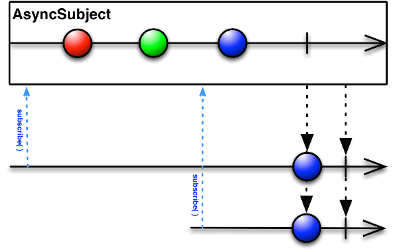

AsyncSubject 클래스는 지금까지와는 다르게 마블다이어그램의 아래쪽에 있는 구독자의 시간 표시줄이 여러개인 것이 다르다. 처리 흐름은 다음과 같다.
* 1. 처음 구독자가 subscribe() 함수를 호출하다.
* 2. 이후에 빨간 원, 초록 원이 발행된 후 두번째 구독자가 subscribe() 함수를 호출한다.
* 3. 마지막으로 파란색 원이 발행되고 데이터 발행을 완료(onComplete 이벤트)한다.

이때 완료되기 전까지는 구독자에게 데이터를 전달하지 않다가 완료됨가 동시에 첫번째와 두번째 구독자에게 마지막 데이터를 발행하고 종료한다.

#### 마블 다이어그램으로 RxJava 이해하기
RxJava를 처음에 배울때는 새로운 용어도 많고 차이점도 명쾌하지 않다고 느낄 수 있다. 그럼 RxJava를 이해하는데 가장 중요한것을 '시간'이라고 생각해본다. 수많은 마블 다이어그램은 시간을 중심으로 쉽게 풀어놓은 것이다. 마블 다이어그램을 살펴본후 코드를 살펴보는 과정을 반복하면 RxJava를 실무에 적용하는데 도움이 될것이다.

```java
AsyncSubject<String> subject = AsyncSubject.create();
subject.subscribe(data -> System.out.println("Subscriber #1 => " + data));
subject.onNext("RED");
subject.onNext("GREEN");
subject.subscribe(data -> System.out.println("Subscriber #2 => " + data));
subject.onNext("BLUE");
subject.onComplete();
```

먼저 AsyncSubject 객체인 subject는 정적 팩토리 함수인 create()로 생성한다. 이전에 살펴본 Observable.create()와 같은 기능이다. subscribe() 함수를 호출하여 구독을 시작한다. subscribe() 함수의 원형은 Observable의 subscribe() 함수와 같다. 따라서 data -> {} 형식의 람다 표현식을 활용한다.

onNext() 함수를 호출하면 데이터를 발행한다. subject 변수에서 String 타입을 지정했으므로 String 타입을 onNext()의 인자로 넣어주어야 한다. 'GREEN'라는 데이터를 발행한 후에는 두번째 구독자가 subscribe()를 호출한다.

'BLUE'라는 데이터를 발행한 후에는 마지막으로 onComplete() 함수를 호출했다. 이때 마지막으로 입력된 데이터가 구독자에게 최종전달된다. AsyncSubject 클래스는 구독자로도 동작할 수 있다. 다음은 AsyncSubject 클래스가 Observable의 구독자로 동작하는 예제이다.

```java
Float[] temperature = {10.1f, 13.4f, 12.5f};
Observable<Float> source = Observable.fromArray(temperature);

AsyncSubject<Float> subject = AsyncSubject.create();
subejct.subcribe(data -> System.out.println("Subscriber #1 => " + data));

source.subscribe(subject);
```

먼저 10.1f 등의 Float 타입 온도 데이터를 담은 Observable을 생성한다. Observable 타입의 변수 이름은 source이다. 다음은 subject 변수에 AsyncSubject 객체를 생성하고 data를 수신할 수 있도록 subscribe() 함수를 호출한다. 마지막으로 subject 변수는 Observable인 source를 구독한다.

이런 과정이 어떻게 가능할까? 다음처럼 Subject 클래스가 Observable을 상속하고 동시에 Observer 인터페이스를 구현하기 때문이다.

```java
public abstract class Subject<T> extends Observable<T> implements Observer<T>
```

마지막으로 AsyncSubject에 클래스에서 onComplete() 함수를 호출한 후에 구독할 때를 살펴본다. 마블 다이어그램에 있는 상황은 아니지만 이럴때도 마지막에 발행된 값을 가져올 수 있다.

```java
AsyncSubject<Integer> subject = AsyncSubject.create();
subject.onNext(10);
subject.onNext(11);
subject.subscribe(data -> System.out.println("Subscriber #1 => " + data));
subject.onNext(12);
subject.onComplete();
subject.onNext(13);
subject.subscribe(data -> System.out.println("Subscriber #2 => " + data));
subject.subscribe(data -> System.out.println("Subscriber #3 => " + data));
```

'10', '11'이라는 데이터를 발행한 후 첫번째 구독자가 subscribe() 함수를 호출하고 '12'라는 데이터를 발행한 후 onComplete() 함수를 호출했다. Observable과 마찬가지로 onComplete() 함수 호출 이후에는 onNext 이벤트를 무시한다. 그다음 두번째와 세번째 구독자가 subscribe() 함수를 호출했다. 실행 결과는 모두 12라는 같은 값을 전달받게 된다.

### 2) BehaviorSubject 클래스
BehaviorSubject는 (구독자가) 구독을 하면 가장 최근 값 혹은 기본값을 넘겨주는 클래스이다. 예를 들어 온도 센서에서 값을 받아온다면 가장 최근의 온도 값을 받아오는 동작을 구현할 수 있다. 또한 온도를 처음 얻을때는 초깃값(예를 들면 0)을 반환하기도 한다.

BehaviorSubject 클래스의 마블 다이어그램은 다음과 같다.

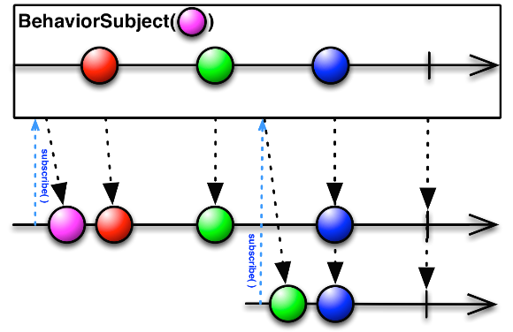

여기서 'PINK' 원은 BehaviorSubject 클래스를 생성할때 넘긴 기본값이다. 첫번째 구독자는 기본값을 받고 다음에 'RED' 원부터 수신한다. 두번째 구독자는 'GREEN' 원이 발행된 이후에 구독했으므로 'GREEN' 원을 맨처음 전달한다. 이를 소스 코드로 구현하면 다음과 같다.

```java
BehaviorSubject<String> subject = BehaviorSubject.createDefault("PINK");
subject.subscribe(data -> System.out.println("Subscriber #1 =>" + data));
subject.onNext("RED");
subject.onNext("GREEN");
subject.subscribe(data -> System.out.println("Subscriber #2 =>" + data));
subject.onNext("BLUE");
subject.onComplete();
```

BehaviorSubject 클래스는 AsyncSubject 클래스와는 다르게 createDefault() 함수로 생성한다. 구독자가 subscribe() 함수를 호출했을때 그전까지 발행한 값이 없다면 기본값을 대신 발행해야 하기 때문이다.

첫번째 구독자가 subscribe() 함수를 호출하면 차례로 "RED", "GREEN"이라는 데이터를 발행한다. 두번째 구독자가 subscribe() 함수를 호출하면 마지막으로 "BLUE"라는 데이터를 발행한 후 onComplete() 함수를 호출한다.

첫번째 구독자는 그전까지 발행된 데이터가 없었으므로 기본값인 'PINK'를 전달받는다. 두번째 구독자는 subscribe() 함수를 호출하기 바로 전에 발행한 "GREEN"을 맨 처음에 전달받는다. "BLUE"는 구독자 모두에게 발행한다.

### 3) PublishSubject 클래스

가장 평범한 Subject 클래스이다. 구독자가 subscribe() 함수를 호출하면 값을 발행하기 시작한다. AsyncSubject 클래스처럼 마지막 값만 발행하거나 BehaviorSubject 클래스처럼 발행한 값이 없을때 기본값을 대신 발행하지도 않는다. 오직 해당 시간에 발생한 데이터를 그대로 구독자에게 전달받는다.

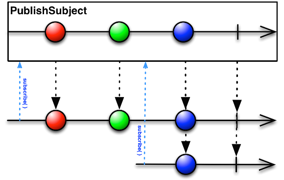

위 마블 다이어그램은 아래 코드처럼 작성할 수 있다.

```java
PublishSubject<String> subject = PublishSubject.create();
subject.subscribe(data -> System.out.println("Subscriber #1 => " + data));
subject.onNext("RED");
subject.onNext("GREEN");
subject.subscribe(data -> System.out.println("Subscriber #1 => " + data));
subject.onNext("BLUE");
subject.onComplete();
```

PublishSubject 클래스는 별도의 기본값을 제공하지 않으므로 AsyncSubject 클래스처럼 create() 함수를 호출해 생성한다.

첫번째 구독자가 subscribe() 함수를 호출하면 'RED', 'GREEN'이라는 데이터를 발행한다. 두번째 구독자가 subscribe() 함수를 호출하면 'BLUE'를 발행하고 onComplete() 함수를 호출해 데이터 발행을 완료한다.

첫번째 구독자는 Subject 클래스가 발행한 'RED', 'GREEN', 'BLUE' 데이터를 모두 전달받으며, 두번째 구독자는 구독한 이후에 발행된 데이터인 'BLUE'만 전달 받는다.

### 4) ReplaySubject 클래스
마지막으로 소개할 Subject 클래스는 가장 특이하고 사용할때 주의해야 하는 ReplaySubject 클래스이다. Subject 클래스의 목적은 Hot Observable을 활용하는 것인데 Cold Observable처럼 동작하기 때문이다.

ReplaySubject 클래스는 구독자가 새로 생기면 항상 데이터의 처음부터 끝까지 발행하는 것을 보장해준다. 마치 테이프로 전체 내용을 녹음해두었다가 새로운 사람이 들어오면 정해진 음악을 처음부터 들려주는 것과 같다.

그러므로 모든 데이터 내용을 저장해두는 과정 중 메모리 누수가 발생할 가능성을 염두에 두고 사용할때 주의해야한다.

ReplaySubject 클래스의 마블 다이어그램은 아래와 같다.

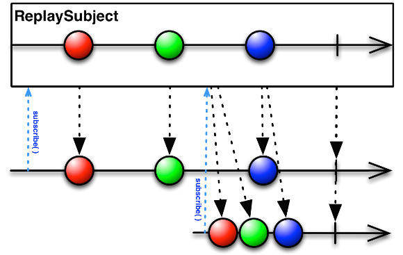

위 마블 다이어그램은 아래처럼 작성할 수 있다.

```java
ReplaySubject<String> subject = ReplaySubject.create();
subject.subscribe(data -> System.out.println("Subscriber #1 => " + data));
subject.onNext("RED");
subject.onNext("GREEN");
subject.subscribe(data -> System.out.println("Subscriber #2 => " + data));
subject.onNext("BLUE");
subject.onComplete();
```

ReplaySubject 클래스의 객체는 create()라는 정적함수를 호출하여 생성한다. 첫번째 구독자는 Observable을 구독한 이후에 발행한 'RED', 'GREEN'를 전달받는다. 두번째 구독자는 subscribe() 함수를 호출하면 지금까지 발행된 'RED', 'GREEN'을 전달받는다. 마지막으로 Subject 클래스가 'BLUE'를 발행하면 두 구독자 모두 해당 값을 전달받는다.

#### 데이터 발행자와 수신자
지금까지 Observable을 살펴보면서 다양한 용어르 새로 배웠다. 간단한 기준으로 이를 분류해본다. 크게 데이터를 발행하는 쪽과 데이터를 수신하는 쪽으로 분류할 수 있다.

|---|---|
|데이터 발행자(data source)|데이터 수신자|
|---|---|
|Observable|-|
|Single|구독자(Subscriber)|
|Maybe|옵서버(Observer)|
|Subject|소비자(Consumer)|
|Completable|-|

데이터 발행자는 클래스 개념이므로 명확하게 구분된다. 그러나 데이터 수신자는 몇가지 용어를 번갈아가면서 사용하며 개념이 명확하게 구분되지 않는다. 실제로  RxJava 문서에서도 용어 하나로 통일하지 않았다.
* 1. 구독자: RxJava에서 Observable과 연결할때는 subscribe() 함수를 호출한다. 이 과정이 구독이므로 구독자가 된다.
* 2. 옵저버: RxJava는 옵저버 패턴을 구현한다. 따라서 데이터 발신자는 Observable이 되고 데이터 수신자를 옵저버라고 할 수 있다.
* 3. 소비자: RxJava 1.x에서는 subscribe() 함수를 호출할때 Subscriber 클래스를 인자로 넘겼지만 RxJava2에서는 모두 함수형 인터페이스인 Consumer를 인자로 넘긴다. 이는 자바8과 같은 이름을 사용하기 위해서이다.

## ConnectableObservable 클래스
Observable의 수많은 변형을 다루었다. 주어진 데이터를 발행하려고 just()나 fromArray() 함수를 사용할때도 있었고 PublishSubject, AsyncSubject 클래스처럼 Observable이면서 옵저버도 되는 Subject 클래스도 살펴보았다.

ConnectableObservable 클래스는 Subject 클래스처럼 Cold Observable을 Hot Observable으로 변환한다. Observable을 여러 구독자에게 공유할 수 있으므로 원 데이터 하나를 여러 구독자에게 동시에 전달할 때 사용한다. 특이한 점은 subscribe() 함수를 호출해도 아무 동작이 일어나지 않는다는 것이다. 새로 추가된 connect() 함수는 호출한 시점부터 subscribe() 함수를 호출한 구독자에게 데이터를 발행하기 때문이다.

ConnectableObservable 객체를 생성하려면 먼저 Observable에 publish() 함수를 호출해야 한다. 이 함수는 여러 구독자에게 데이터를 발행하기 위해 connect() 함수를 호출하기 전까지 데이터 발행을 유예하는 역할을 한다. ConnectableObservable.publish()의 마블 다이어그램은 다음과 같다.

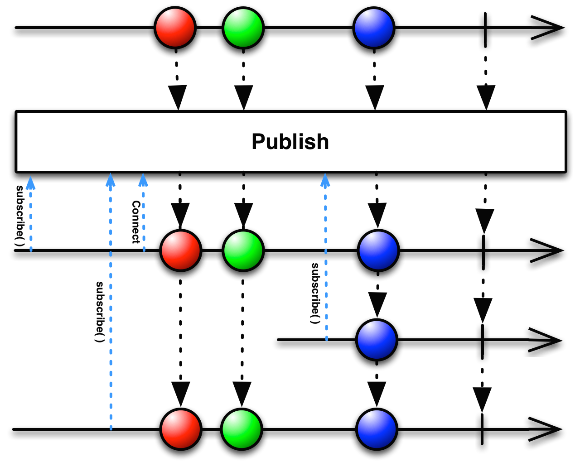

기존의 마블 다이어그램과는 차이가 있다. 보통은 Observable에 subscribe() 함수를 호출해야 데이터발생을 시작하는데 이제는 아무런 일도 일어나지 않는다. 오로지 connect() 함수를 호출해야 그때까지 구독했던 구독자 모두에게 데이터를 발행한다. connect() 함수를 호출한 이후에 구독한 구독자에게는 구독이후에 발생한 데이터부터 발행한다.

```java
String[] dt = {"RED", "GREEN", "BLUE"};
Observable<String> balls = Observable.interval(100L, TimeUnit.MILLISECONDS)
    .map(Long::intValue)
    .map(i -> dt[i])
    .take(dt.length);
ConnectableObservable<String> source = balls.publish();
source.subscribe(data -> System.out.println("Subscriber #1 => " + data));
source.subscribe(data -> System.out.println("Subscriber #2 => " + data));
source.connect();

CommonUtils.sleep(250);
source.subscribe(data -> System.out.println("Subscriber #3 => " + data));
CommonUtils.sleep(100);
```

발행하려는 데이터는 'RED', 'GREEN', 'BLUE'이다. Observable.interval()은 인자 2개를 받는데 각각 시간과 시간의 단위이다. 여기서는 100ms 단위로 0부터 데이터를 발행한다.

interval() 함수는 테스트 코드를 작성할때 많이 활용한다. 지금은 100ms 간격으로 데이터를 발행한다고 생각하면 된다.

첫번째와 두번째 구독자가 추가되면 connect() 함수를 호출해 데이터 발생을 시작한다. 그다음 세번째 구독자가 나오기전까지 sleep() 함수를 이용해 250ms를 기다리고 세번째 구독자를 추가한다. connect() 함수를 호출했으므로 이후에는 구독하면 다음의 데이터를 바로 수신할 수 있다.

sleep() 함수를 이용해 100ms를 기다린 후에는 balls 객체의 데이터를 모두 발행한다. 따라서 세 구독자 모두 구독해지 된다.

RxJava의 중심이 되는 Observable 클래스를 살펴봤다. Observable의 생성은 juse(), fromArray() 등의 팩토리 함수를 이용한다.

또한 Observable 클래스는 데이터를 발행하는 팩토리 함수뿐만 아니라 그것을 처리할 수 있는 연산자도 함께 제공한다. 팩토리 함수와 연산자를 함께 사용하는 기법을 메서드 체이닝(method chaining)이라고 한다.

> 출처: https://12bme.tistory.com/570 [길은 가면, 뒤에 있다.]